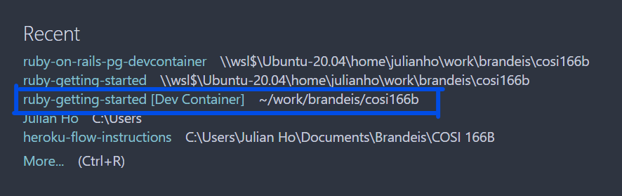

# ruby-on-rails-pg-devcontainer

This repo contains a setup for devcontainer using Ruby on Rails with Postgres.

For ease of use, we also included a generated Rails template using the container here.

## Prerequisite

- VSCode with [`Remote - Containers` extension](https://marketplace.visualstudio.com/items?itemName=ms-vscode-remote.remote-containers) installed

## Setup

1. Download this repo

2. Copy the `.devcontainer` folder to your project folder

3. Open `View -> Command Palette` and input `Remote-Containers: Rebuild and Reopen in Container`
    

4. Done! Now your project is opened in a Ruby on rails environment!

## Use

Once the setup is completed, there is no need to rebuild the container everytime.

To reopen a project, open the project under the `Welcome` page. A properly setup project's name is always suffixed with `[Dev Container]`.

## Database migrate

1. Ensure the database configs are setup correctly (`config/database.yml` file)

2. Run `bundle` to install all needed gems

3. `bundle exec rake db:migrate`

## Database Settings

Default settings are as follows,

* database: `postgres`
* username: `postgres`
* password: `postgres`
* host: `localhost`

Settings can be modified under `.devcontainers/docker-compose.yaml`. Remember to rebuild the container after modifying the settings (`Remote-Containers: Rebuild Container` under command palette).

## Versions

* Ruby `2.7.2p137 (2020-10-01 revision 5445e04352) [x86_64-linux]`
* Rails `6.1.3`
* Bundler `2.1.4`
* Heroku-cli `7.50.0`
