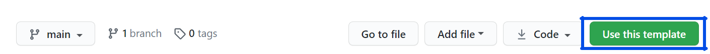

# ruby-on-rails-pg-devcontainer

This repo contains a setup for [devcontainer](https://code.visualstudio.com/docs/remote/containers) using Ruby on Rails with Postgres.

For ease of use, we also included a generated Rails template using the container here.

## Prerequisite

- VSCode with [`Remote - Containers` extension](https://marketplace.visualstudio.com/items?itemName=ms-vscode-remote.remote-containers) installed

## Uses

There are two different ways to use this repo,

1. [Use with existing Rails project](#setup-for-existing-project)

2. [Use as a new Rails project](#setup-for-new-project)

## Setup for existing project

1. Download this repo

2. Copy the `.devcontainer` folder to your project folder

3. Open project folder in VSCode, open `View -> Command Palette` and input `Remote-Containers: Rebuild and Reopen in Container`

    

4. Done! Now your project is opened in a Ruby on rails environment!

## Setup for new project

1. Click "Use this template", and setup your desired repo name

    

2. Clone the project under your repo

3. Open project folder in VSCode, open `View -> Command Palette` and input `Remote-Containers: Rebuild and Reopen in Container`

    

4. Done! Now your project is opened in a Ruby on rails environment!

## Use

Once the setup is completed, there is no need to rebuild the container everytime.

To reopen a project, open the project under the `Welcome` page. A properly setup project's name is always suffixed with `[Dev Container]`.


## Pushing to heroku

The devcontainer comes with `heroku-cli` preinstalled, all you need to do before is `heroku login`.

## Database migrate

1. Ensure the database configs are setup correctly (`config/database.yml` file, see [example](#database.yml-example))

2. Run `bundle` to install all needed gems

3. `bundle exec rails db:migrate`

### `database.yml` example

```yaml
default: &default
  adapter: postgresql
  encoding: unicode
  pool: <%= ENV.fetch("RAILS_MAX_THREADS") { 5 } %>

development:
  <<: *default
  database: myapp_development
  username: postgres
  password: postgres
  host: localhost
  port: 5432

test:
  <<: *default
  database: myapp_test

production:
  <<: *default
  database: myapp_production
  username: myapp
  password: <%= ENV['MYAPP_DATABASE_PASSWORD'] %>
```

## Database Settings

Default settings are as follows,

* username: `postgres`
* password: `postgres`
* host: `localhost`

Settings can be modified under `.devcontainers/docker-compose.yaml`. Remember to rebuild the container after modifying the settings (`Remote-Containers: Rebuild Container` under command palette).

## Versions

* Ruby `2.7.2p137 (2020-10-01 revision 5445e04352) [x86_64-linux]`
* Rails `6.1.3`
* Bundler `2.1.4`
* Heroku-cli `7.50.0`
